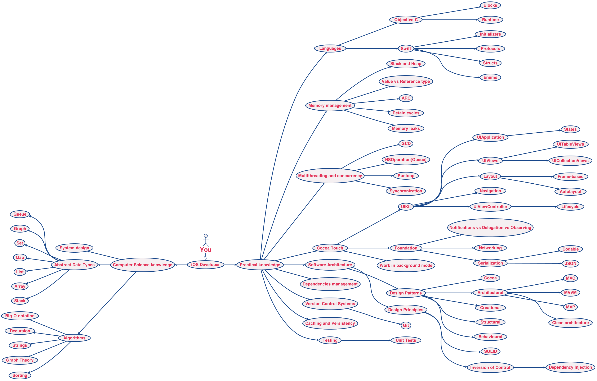

# iOS Developer Roadmap
Be professional 🚀

## iOS Development Technology

###UI
- //TODO

###Objective-C language
- //TODO

###Runtime
- //TODO

###Memory management
- //TODO

###Block
- //TODO

###MultiThreading
- //TODO

###RunLoop
- //TODO

###Network
- //TODO

###Design patterns
- //TODO

###Architecture patterns
- //TODO

###Algorithm
- //TODO

###Third-party libraries
- //TODO

## Development Process
###Full App Development Process
- Project Kickoff
    - Responsibility Matrix
        + Sign-off with all involved parties
    - High Level Product Requirement Documents
        + Feature list
        + UI Concepts / Wireframe / UI design first draft
        + Sign-off by Customer
    - Timeline -  Milestones
        + Aligned with product schedule
        + Sign-off by SW PM
    - Resource allocation
       + Sign-off by SW PM
- Pre-Alpha
    - Technical Design Document
        + High level technical design
        + First draft
     - Test Plan
- Alpha
    - UI/UX Review Cycle 
        + Customer / UI/UX designer review and feedback
     - QA Cycle
- Beta
    - Feature freeze
    - IOP Plan
- Goldmaster
    - IOP report
    - Known issues list
    - Code freeze
    - Apple App Store approval materials
    - App store / Google Play Store / Amazon App Store metadata and artworks
    - Distribution Certificate
    - Stakeholders sign off

###SDK Release Process
- SDK Alpha Release (Initial release for Developer Preview. Multiple cycle)
    1. SDK libraries 

- SDK Beta Release (APIs freeze. Document stable. Could be Multple cycles)¶
    1. SDK Libraries
    2. APIs / Interface Document
    3. Programming Guide (with specification)

- SDK Final Release (Stable release)
    1. SDK Libraries
    2. API / Interface Document
    3. Programming Guide (With specification)
    4. Technical Design Document

###Development
- [Code Standard](https://developer.apple.com/library/mac/documentation/Cocoa/Conceptual/CodingGuidelines/CodingGuidelines.html)
- [Versioning](https://semver.org)
- Source Control Management (Version Control)
    + Commit Often
    + Push Often
    + Always left master as the stable branch. NEVER DEVELOP ON MASTER.
- Unit Testing
    + [OCMock for Objective-C](http://ocmock.org)
- Documentation
    + [AppleDoc](http//github.com/tomaz/appledoc.git)
- Continuous Integration / Continuous Deployment
    + Jenkins

## Development Tools
###[Markdown](https://github.com/younghz/Markdown)
 A plain text formatting syntax designed so that it can optionally be converted to HTML.
###[Sublime Text](https://github.com/jikeytang/sublime-text)
A sophisticated text editor for code, markup and prose
###[VPS+Shadowsocks](https://teddysun.com/486.html)
"Across the Great Wall we can reach every corner of the world."